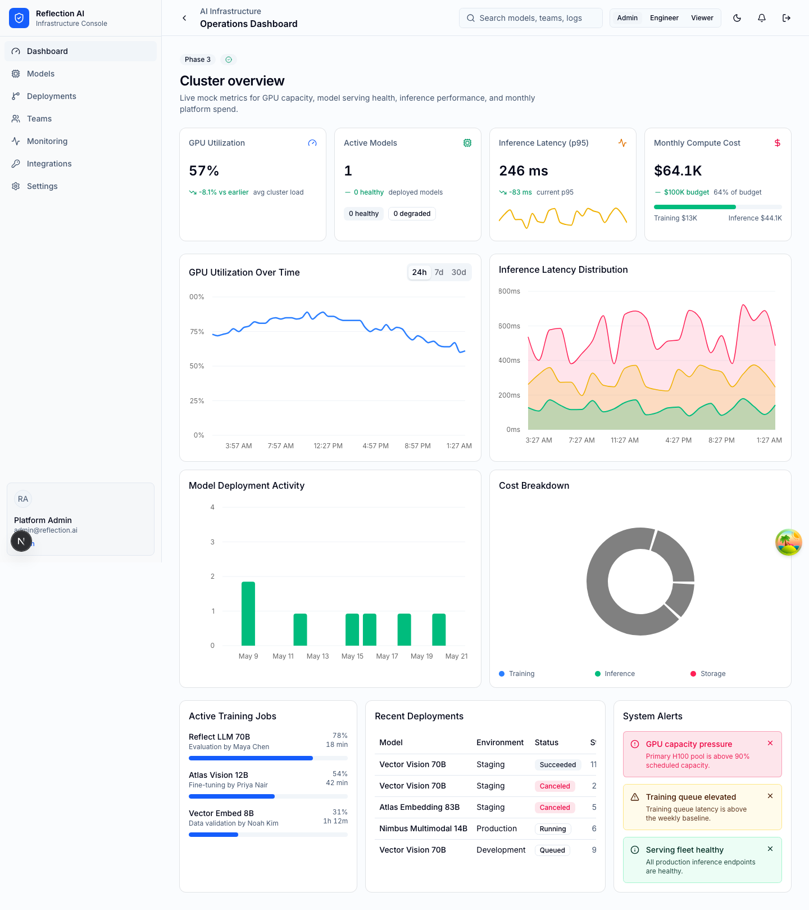
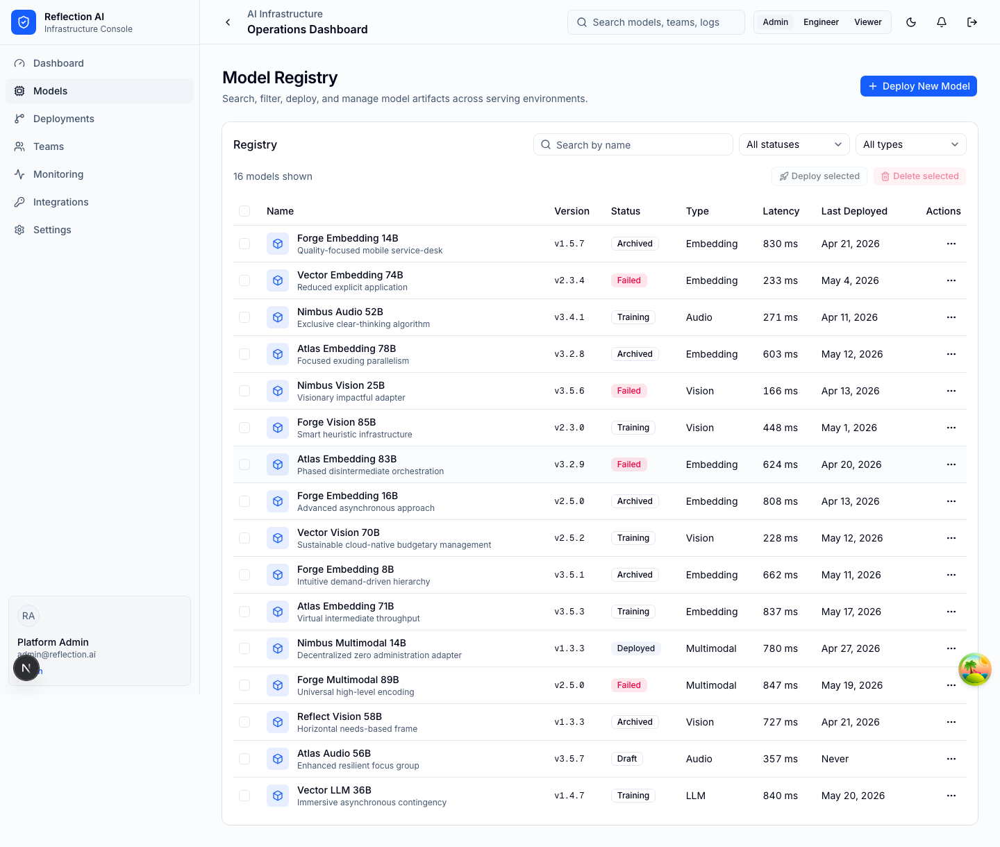
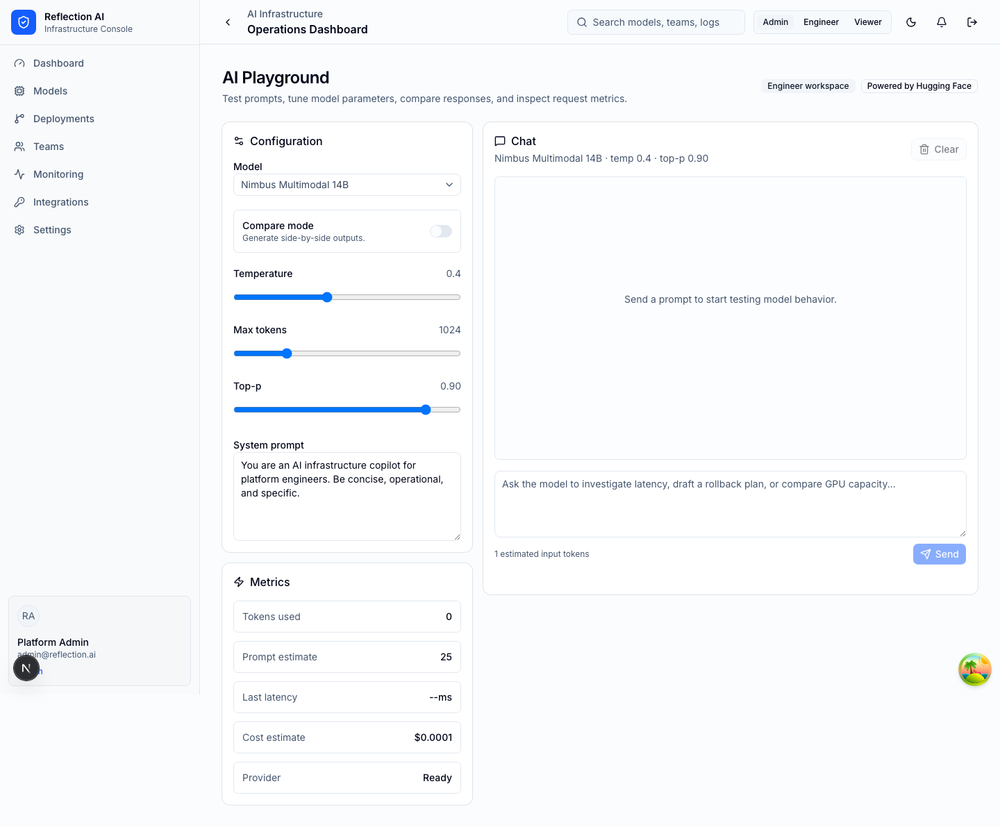

# AI Infrastructure Console

AI Infrastructure Console is a Next.js enterprise dashboard for operating an AI platform. It models the day-to-day workflows platform teams need: GPU and inference monitoring, model registry management, deployment tracking, RBAC, integrations, audit trails, billing visibility, and an AI playground backed by Hugging Face when a token is configured.

The app is intentionally self-contained. MSW provides a typed mock API in development and tests, so the full console can run locally without external infrastructure.

## Screenshots

| Operations dashboard                                           | Model registry                                                | AI playground                                            |
| -------------------------------------------------------------- | ------------------------------------------------------------- | -------------------------------------------------------- |
|  |  |  |

## Tech Stack

| Area                 | Technology                                         |
| -------------------- | -------------------------------------------------- |
| Framework            | Next.js 16 App Router, React 19, TypeScript        |
| Styling              | Tailwind CSS 4, shadcn/ui primitives, Lucide icons |
| Data fetching        | TanStack Query, typed API client                   |
| State                | Zustand stores for auth, UI, and theme state       |
| Mock API             | MSW 2, faker-generated domain data                 |
| Forms and validation | React Hook Form, Zod                               |
| Tables and charts    | TanStack Table, Recharts                           |
| Testing              | Vitest, React Testing Library, Playwright          |

## Architecture

The application is organized around the Next.js App Router:

- `app/(dashboard)` contains authenticated dashboard routes and the shared shell.
- `components/ui` contains shadcn-style primitives; feature components live beside their domain.
- `hooks` wraps TanStack Query calls and owns cache keys.
- `lib/api-client.ts` is the browser-facing API client.
- `mocks/handlers.ts` implements the REST surface used by the dashboard.
- `stores` contains persisted Zustand state for auth, theme, and UI.
- `tests` contains Vitest unit/component tests and Playwright E2E flows.

See [ARCHITECTURE.md](ARCHITECTURE.md) for the full data-flow explanation.

## Setup

Install dependencies:

```bash
npm install
```

Create local environment variables:

```bash
cp .env.example .env
```

Optional Hugging Face integration:

```bash
HF_TOKEN=hf_your_token
HUGGINGFACE_MODEL=HuggingFaceH4/zephyr-7b-beta
```

Start the app:

```bash
npm run dev
```

Open `http://localhost:3000`. The default login form accepts any non-empty email and password. Use the demo role selector to switch between Admin, Engineer, and Viewer access.

## Scripts

```bash
npm run dev       # Next.js dev server on localhost:3000
npm run build     # Production build
npm run lint      # ESLint
npm run test      # Vitest unit and component tests
npm run test:e2e  # Playwright E2E tests on localhost:3100
```

## Mock API

MSW starts automatically in development through `components/msw-provider.tsx`. The typed client in `lib/api-client.ts` calls these endpoints:

| Endpoint                                   | Purpose                                    |
| ------------------------------------------ | ------------------------------------------ |
| `GET /api/metrics/gpu`                     | GPU time-series metrics                    |
| `GET /api/metrics/gpu/summary`             | Current cluster utilization summary        |
| `GET /api/metrics/inference`               | Latency and throughput metrics             |
| `GET /api/models`                          | Paginated model registry                   |
| `GET /api/models/:id`                      | Model detail with versions and deployments |
| `POST /api/models/:id/deploy`              | Mock model deployment                      |
| `GET /api/deployments`                     | Deployment pipeline list                   |
| `GET /api/teams`                           | Team members and RBAC roles                |
| `POST /api/teams/invite`                   | Invite a member                            |
| `PATCH /api/teams/:id/role`                | Update member role                         |
| `GET /api/api-keys` / `POST /api/api-keys` | API key list and generation                |
| `POST /api/api-keys/:id/revoke`            | Revoke an API key                          |
| `GET /api/webhooks` / `POST /api/webhooks` | Webhook list and creation                  |
| `GET /api/webhooks/deliveries`             | Webhook delivery history                   |
| `GET /api/billing/usage`                   | Billing usage and service breakdowns       |
| `GET /api/billing/invoices`                | Invoice history                            |
| `GET /api/audit-logs`                      | Filterable audit trail                     |
| `POST /api/playground/completion`          | Mock playground completion                 |

The optional real playground route is `POST /api/playground/huggingface`. It uses `HF_TOKEN` when present and falls back to mock responses if the provider is unavailable.

## Documentation

- [ARCHITECTURE.md](ARCHITECTURE.md): data flow, routing, state, mocks, testing strategy

